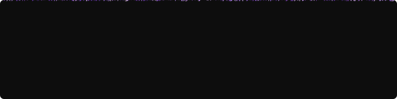

<h1 align="center">Hi, I'm İrem 👋</h1>

  <em>Aspiring Game Developer — I enjoy learning something new every single day 🎮</em>

💻 Tech Stack

  
  
  
  
  
  
  
  
  
  
  

📊 GitHub Stats

  
  

  

